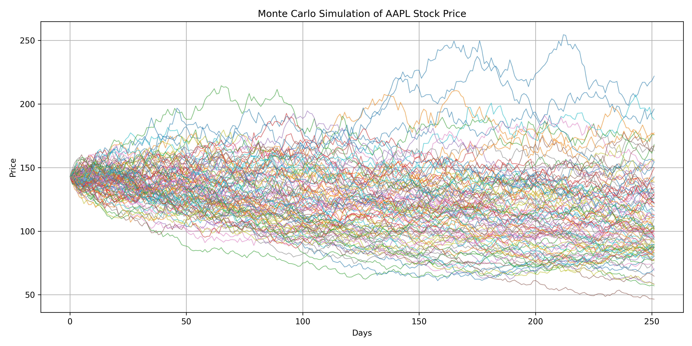

# Monte Carlo Stock Price Simulation

This Python script performs a **Monte Carlo simulation** to forecast potential future stock prices. The simulation uses historical price data to model the stock's future path, considering its historical volatility and average daily return.



***

### Features

-   Generates a Monte Carlo simulation of stock price movements using the **Geometric Brownian Motion (GBM)** model.
-   Calculates key metrics like daily returns and volatility from historical data.
-   Visualizes the simulation results with an easy-to-read chart, saving it as a `.png` file.
-   Exports all simulation data to a `.csv` file for further analysis.

***

### Theoretical Basis

A **Monte Carlo simulation** is a computational technique that uses repeated random sampling to model the probability of different outcomes in a process that is difficult to predict. In finance, it is a powerful tool for valuing assets and forecasting price movements.

#### Geometric Brownian Motion (GBM)

The theoretical foundation for this script is **Geometric Brownian Motion (GBM)**, a widely used model in mathematical finance to describe the random movement of stock prices. It assumes that stock price returns follow a **log-normal distribution**.

The core of the simulation is a discretized version of the GBM formula:

$$S_t = S_0 \cdot e^{(\mu - \frac{1}{2}\sigma^2)t + \sigma W_t}$$

Where:
* $S_t$: The stock price at time $t$.
* $S_0$: The initial stock price.
* $\mu$: The expected annualized return (drift).
* $\sigma$: The annualized volatility (standard deviation of returns).
* $W_t$: The Wiener process, a random variable from a standard normal distribution.

The script repeatedly applies this formula over a specified time horizon, generating thousands of possible future price paths.

***

### Getting Started

#### Prerequisites

To run this script, you need to have **Python 3** and the following libraries installed. You can install them using `pip`:

```bash
pip install numpy pandas matplotlib
